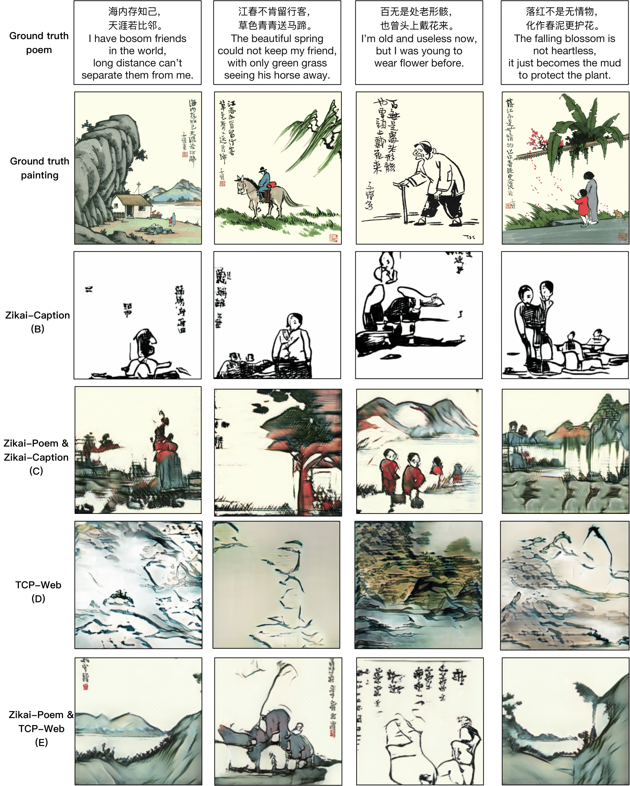

# paint4poem

Pytorch implementation for paper Paint4Poem: a Dataset for Artistic Visualizationof Classical Chinese Poems.
Paint4poem dataset sample: [Sample data](https://surfdrive.surf.nl/files/index.php/s/rKffQJC9IVE5sKD).

## Data

Dowload our poem, caption, web dataset and save them to data/

## Training

- Pre-train DAMSM models:
  - For poem dataset: `python pretrain_DAMSM.py --cfg cfg/DAMSM/zikai_poem.yml --gpu 0`
  - For caption dataset: `python pretrain_DAMSM.py --cfg cfg/DAMSM/zikai_title.yml --gpu 1`
 
- Train AttnGAN models:
  - For poem dataset: `python main_poem.py --cfg cfg/zikai_poem_attn2_.yml --gpu 2`
  - For caption dataset: `python main_poem.py --cfg cfg/zikai_title_attn2_.yml --gpu 3`

- `*.yml` files are example configuration files for training/evaluation our models.

## Sampling
- Run `python main_poem.py --cfg cfg/eval_try.yml --gpu 1` to generate examples from captions in files listed in "./data/birds/example_filenames.txt".  
- Change the `eval_*.yml` files to generate images from other pre-trained models. 

## Validation
- To generate images for all captions in the validation dataset, change B_VALIDATION to True in the eval_*.yml. and then run `python main_poem.py --cfg cfg/eval_try.yml --gpu 1`
- We compute inception score for models trained on coco using [improved-gan/inception_score](https://github.com/openai/improved-gan/tree/master/inception_score).
- We compute R_precision score based on [R-precision from DM-GAN](https://github.com/MinfengZhu/DM-GAN/blob/master/code/trainer.py).
- We compute global effect and Local partern based on paper [Evaluate and improve the quality of neural style transfer](https://www.sciencedirect.com/science/article/abs/pii/S1077314221000473#!).
- We compute FID using [pytorch-fid](https://github.com/mseitzer/pytorch-fid).

## Generated image examples

 <! ---    -->

## Contributing
Pull requests are welcome. For major changes, please open an issue first to discuss what you would like to change.

Please make sure to update tests as appropriate.

## License
[MIT](https://choosealicense.com/licenses/mit/)