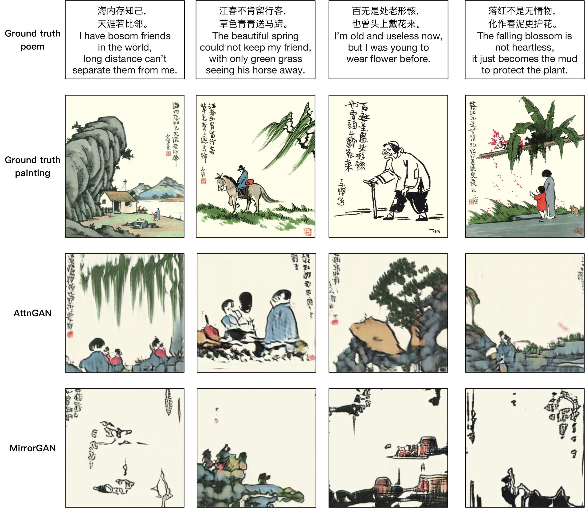

# Introduction

We propose a new task -- artistic visualization of classical Chinese poems, where the goal is to generate paintings of a certain artistic style for classical Chinese poems. 

For this goal, we construct a new dataset called Paint4Poem. 

Paint4Poem consists of three sets: 
- **Zikai-Poem**: 301 poem-painting pairs collected manually from an influential modern Chinese artist Feng Zikai, 
- **Zikai-Caption**: 3,648 caption-painting pairs collected manually from Feng Zikai's paintings, 
- **TCP-Poem**: 89,204 poem-painting pairs of traditional Chinese painting (TCP) style collected automatically from the web.

We expect the first two sets to help learning the artist painting style of Feng Zikai as it contains his most paintings, and the third one to help learning the semantic relevance between poems and paintings. 

We welcome your discussion and modelling on this dataset.

# Download

Download the [complete data](https://drive.google.com/drive/folders/1ySx3xTq1Lzay6N-2qvqkar9TUkV2eR8q?usp=sharing) or a samll [sample set](https://drive.google.com/file/d/1iJ8WApTiVGznkU2qXcdycZjrQGYxUoOT/view?usp=sharing).

# Examples


# Baselines

## AttnGAN

### Training
- Pre-train DAMSM models:
  - For poem dataset: `python pretrain_DAMSM.py --cfg cfg/DAMSM/zikai_poem.yml --gpu 0`
  - For caption dataset: `python pretrain_DAMSM.py --cfg cfg/DAMSM/zikai_title.yml --gpu 1`
 
- Train AttnGAN models:
  - For poem dataset: `python main_poem.py --cfg cfg/zikai_poem_attn2_.yml --gpu 2`
  - For caption dataset: `python main_poem.py --cfg cfg/zikai_title_attn2_.yml --gpu 3`

- `*.yml` files are example configuration files for training/evaluation our models.

### Validation
- Run `python main_poem.py --cfg cfg/eval_try.yml --gpu 1` to generate examples from captions in files listed in "./data/birds/example_filenames.txt".  
- Change the `eval_*.yml` files to generate images from other pre-trained models.
- To generate images for all captions in the validation dataset, change B_VALIDATION to True in the eval_*.yml. and then run `python main_poem.py --cfg cfg/eval_try.yml --gpu 1`


### Examples of generated paintings



# Evaluation
We evaluate the quality of generated paintings regarding their pictorial quality, stylistic quality, and semantic relevance to the given poem.

### Pictorial quality
- We compute inception score for models trained on coco using [improved-gan/inception_score](https://github.com/openai/improved-gan/tree/master/inception_score).
- We compute FID using [pytorch-fid](https://github.com/mseitzer/pytorch-fid).

### Stylistic quality
- We compute global effect and Local partern based on paper [Evaluate and improve the quality of neural style transfer](https://www.sciencedirect.com/science/article/abs/pii/S1077314221000473#!).

## Semantic relevance
- We compute R_precision score based on [R-precision from DM-GAN](https://github.com/MinfengZhu/DM-GAN/blob/master/code/trainer.py).


# Contributing
Pull requests are welcome. For major changes, please open an issue first to discuss what you would like to change.


# Citation
If you use this repository in your research, consider citing it using the following Bibtex entry:

```
@misc{li2021paint4poem,
title={Paint4Poem: A Dataset for Artistic Visualization of Classical Chinese Poems},
author={Dan Li and Shuai Wang and Jie Zou and Chang Tian and Elisha Nieuwburg and Fengyuan Sun and Evangelos Kanoulas},
year={2021},
eprint={2109.11682},
archivePrefix={arXiv},
primaryClass={cs.CV}
}
```
